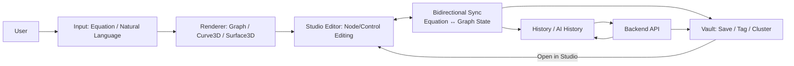

# 🌐 GraphMind (MVP)

**GraphMind**는 사용자가 입력한 **수식 및 자연어 기반 명령어를 2D/3D 그래프로 시각화**하고,  
**노드 기반 편집(Node Manipulation)**을 통해 수학적 구조를 직관적으로 탐색할 수 있도록 설계된 프로젝트입니다.  
학습·연구·데이터 시각화 워크플로우를 하나의 인터페이스로 통합하는 것을 목표로 합니다.

- Frontend: `frontend/` (React + Three.js)
- Backend: `backend/` (Spring Boot)
- (옵션) Desktop: Electron 기반 패키징 확장 예정

---

## Screenshots

### 1) Landing (Product Intro)


### 2) Vault (Graph-based Knowledge / Tag Clustering)


### 3) Studio (Graph, Curve3D, Surface3D, Array3D Editing)

| Graph | Curve3D |
|---|---|
|  |  |

| Surface3D | Array3D |
|---|---|
|  |  |

---

## Project Overview

### Goal
- 자연어/수식 입력 → 그래프(2D/3D) 생성 및 시각화
- 노드 기반 조작으로 그래프 형태를 편집하고, **수식과 그래프를 양방향 동기화**
- Vault 기반으로 수식/그래프 리소스를 축적하고 태그로 연결하여 **재사용 가능한 지식 그래프** 구성

### Team
- Solo Project (Full-Stack)

---

## Key Features

### 1) Graph / Curve3D / Surface3D / Array3D 뷰
- **Graph(2D)**: 좌표계/그리드 기반 그래프 렌더링 + 포인트/노드 편집 UX
- **Curve3D(Parametric)**: `x(t), y(t), z(t)` 형태 곡선 렌더링 및 상호작용
- **Surface3D**: `z = f(x, y)` 형태의 3D 표면 시각화
- **Array3D**: 3차원 배열(볼륨 데이터) 시각화/디버그를 위한 렌더링 UI(검증용 확장 포인트)

### 2) Studio: 편집 중심 작업 공간
- 그래프 위에서 **노드(제어점) 드래그**로 기하 형태를 수정
- 수정 사항을 즉시 반영하여 **수식/파라미터 업데이트**
- **되돌리기(Undo)/다시하기(Redo)** 확장 가능한 구조(리듀서 기반으로 설계 가능)

### 3) 수식 ↔ 그래프 양방향 동기화
- 수식 입력 → 그래프 생성(렌더러)
- 그래프 조작(노드 이동/추가/삭제) → 수식 또는 파라미터 값 갱신
- “결과만 그리는” 방식이 아니라, **편집 상태(State)를 중심으로 동작**하도록 설계

### 4) AI Panel (수식 도우미 / 그래프 조작 / Q&A)
- 수식 해석 및 그래프 특성(절편/극값/대칭 등) 질의
- 작업 히스토리/현재 그래프 상태를 바탕으로 **액션 제안**(확장 포인트)
- 결과를 Markdown/수식(KaTeX) 렌더링 형태로 표시(가독성 강화)

### 5) History & Audit Trail
- 사용자 입력/AI 응답/그래프 변환 이벤트를 타임라인처럼 관리
- 특정 시점 상태로 복원 가능한 형태로 확장 가능(스냅샷/패치 모델)

### 6) Vault (지식 저장소)
- 그래프/수식/메모/태그를 저장하고 리스트/클러스터 형태로 탐색
- Vault 항목에서 **Studio로 바로 전환**하여 편집/확장 작업 수행
- 태그 기반 분류/검색 UI 확장 용이

---

## Demo Video

- **Full demo (mp4, GitHub Release Asset)**: [Download / Open](https://github.com/ppsssj/GraphMind-monorepo/releases/tag/v0.1.0)

> GitHub Release Asset 링크는 환경에 따라 브라우저에서 **바로 재생되지 않고 다운로드**로 동작할 수 있습니다.
---

## Workflow (User Flow)



---

## Tech Stack

### Frontend / Visualization
- React + Vite
- Three.js (`@react-three/fiber`, `@react-three/drei`)
- Math.js (수식 파싱/컴파일)
- KaTeX (수식 렌더링, 적용 시)

### Backend / API
- Java + Spring Boot (Gradle)
- REST API (MVP: Vault / Studio / History / Auth / Health)

### Application (optional)
- Electron (Desktop packaging)

---

## Repository Structure

```text
GraphMind/
  frontend/
  backend/
  assets/              # screenshots for README
  README.md
```

---

## Local Run

### Frontend
```bash
cd frontend
npm install
npm run dev
```

### Backend
```bash
cd backend
./gradlew bootRun
```

---

## Environment Variables (.env)

- `.env`는 Git에 커밋하지 않도록 `.gitignore`에 포함하세요.
- 예시:
  - `VITE_API_BASE_URL=http://localhost:8080`
  - `VITE_OPENAI_PROXY_URL=/api/ai` (프록시 구성 시)

---

## Roadmap
- [ ] Vault: 태그 검색/클러스터 시각화 강화(그래프 기반 뷰)
- [ ] History: 상태 스냅샷/패치 기반 Undo/Redo 고도화
- [ ] Export: SVG/PNG/PDF 내보내기 + 프로젝트 번들링
- [ ] Backend: Vault/History 영속화, 사용자 인증, 권한 분리
- [ ] AI: “그래프 조작 명령” 표준화(안전한 액션 스키마)

---

## License
레포 정책에 맞춰 추가하세요. (예: MIT)
