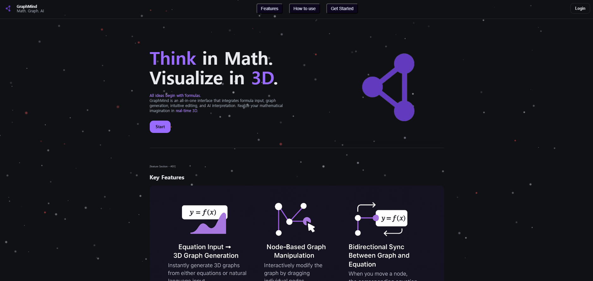
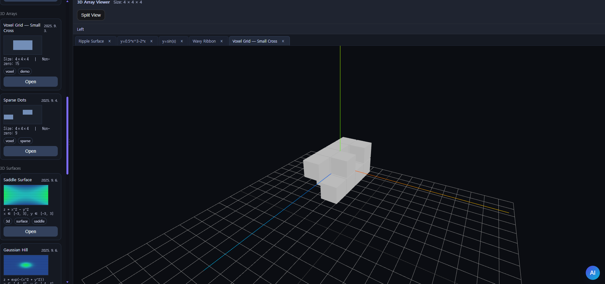

# 🌐 GraphMind (MVP)

**GraphMind**는 사용자가 입력한 **수식 및 자연어 기반 명령어를 2D/3D 그래프로 시각화**하고,  
**노드 기반 편집(Node Manipulation)**을 통해 수학적 구조를 직관적으로 탐색할 수 있도록 설계된 프로젝트입니다.  
학습·연구·데이터 시각화 워크플로우를 하나의 인터페이스로 통합하는 것을 목표로 합니다.

- Frontend: `frontend/` (React + Three.js)
- Backend: `backend/` (Spring Boot)
- (옵션) Desktop: Electron 기반 패키징 확장 예정

---

## Screenshots

### 1) Landing (Product Intro)


### 2) Vault (Graph-based Knowledge / Tag Clustering)


### 3) Studio (Graph, Curve3D, Surface3D, Array3D Editing)

| Graph | Curve3D |
|---|---|
|  |  |

| Surface3D | Array3D |
|---|---|
|  |  |

---

## Project Overview

- **Goal**
  - 자연어/수식 입력 → 그래프(2D/3D) 생성 및 시각화
  - 노드 기반 조작으로 그래프 형태를 편집하고, **수식과 그래프를 양방향 동기화**
  - Vault 기반으로 수식/그래프 리소스를 축적하고 태그로 연결하여 재사용 가능한 지식 그래프 구성

- **Team**: Solo Project (Full-Stack)

---

## Tech Stack

### Frontend / Visualization
- React + Vite
- Three.js
- Math.js

### Backend / API
- Java + Spring Boot (Gradle)
- REST API (MVP: Vault / Studio / History / Auth / Health)

### Application (optional)
- Electron (Desktop packaging)

---

## Repository Structure

```text
GraphMind/
  frontend/
  backend/
  assets/              # screenshots for README
  README.md
