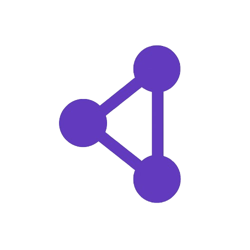
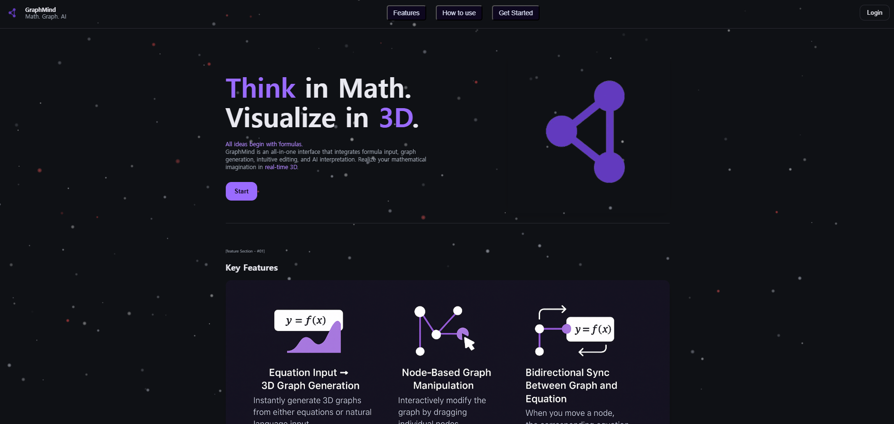
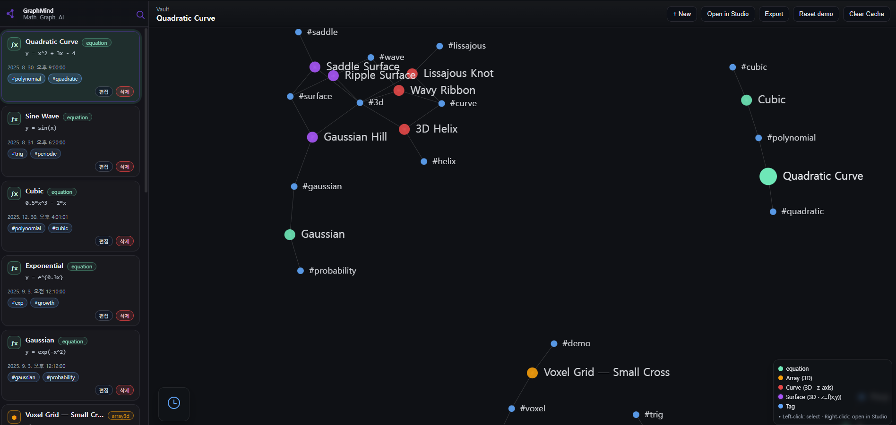
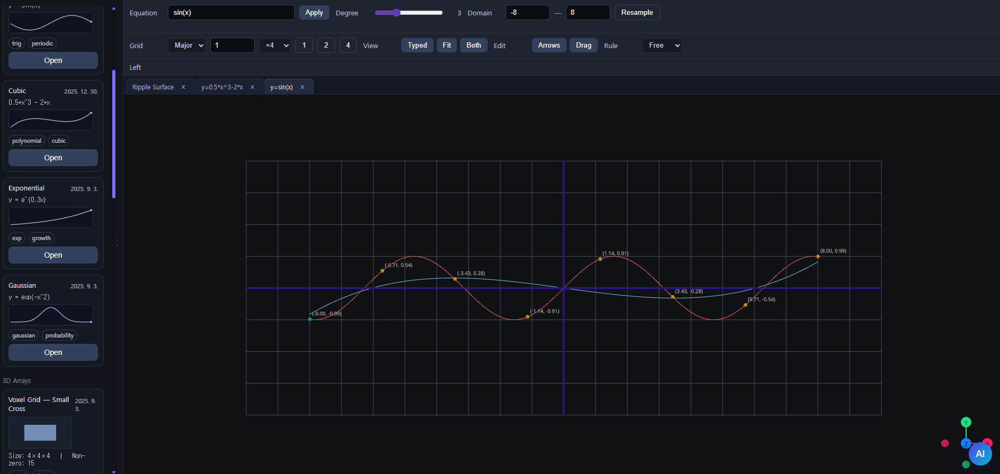
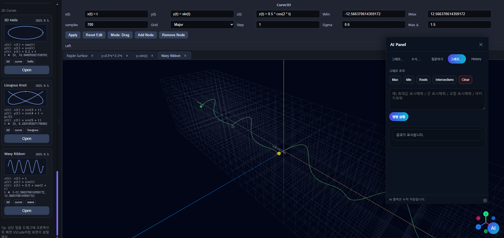
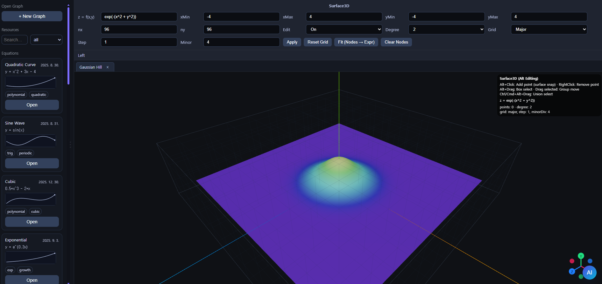
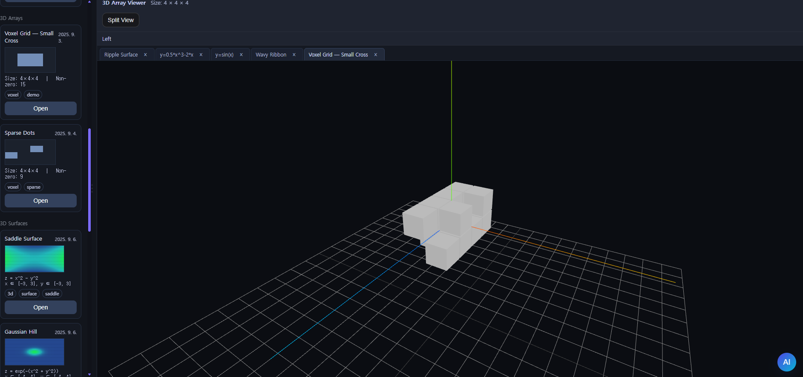

<p align="center">
  
</p>

# GraphMind

GraphMind는 수식과 구조화된 데이터를 2D/3D 그래프로 시각화하고, 그 결과를 직접 편집하고 저장할 수 있게 만드는 인터랙티브 수학 워크스페이스입니다.

단순히 수식을 입력해서 그래프를 보여주는 데서 끝나는 것이 아니라, 다음 흐름을 하나의 작업 공간으로 묶는 것이 이 프로젝트의 핵심입니다.

- 수식이나 그래프 데이터를 입력한다
- 2D 또는 3D 형태로 시각화한다
- Studio에서 그래프를 직접 조작한다
- 결과를 Vault에 저장한다
- 나중에 다시 열어 같은 상태에서 이어서 편집한다

현재 저장소는 React 프론트엔드와 Spring Boot 백엔드로 구성된 MVP 단계의 모노레포입니다.

## 이 프로젝트는 무엇을 하는가

GraphMind는 수학 표현을 더 다루기 쉬운 작업 대상으로 바꾸는 것을 목표로 합니다.

보통 수학 도구는 다음 둘 중 하나에 치우쳐 있습니다.

- 수식을 입력하면 정적인 그래프를 보여주는 도구
- 이미 만들어진 그래프나 데이터를 보기만 하는 도구

GraphMind는 그 중간을 노립니다. 즉, 수식과 그래프와 편집 상태와 저장된 지식을 서로 연결된 상태로 다루는 도구를 지향합니다.

현재 프로젝트가 다루는 주요 대상은 다음과 같습니다.

- 2D 함수 그래프: `y = f(x)`
- 3D 매개변수 곡선: `x(t), y(t), z(t)`
- 3D 곡면: `z = f(x, y)`
- 3차원 배열 데이터: 공간 구조로 볼 수 있는 형태의 데이터

이 결과물들은 단발성 렌더링으로 끝나지 않고, Vault에 저장된 리소스로 관리됩니다.

## 왜 만드는 프로젝트인가

GraphMind는 다음과 같은 문제의식에서 출발합니다.

- 수학 표현은 텍스트만으로 보기 어렵다
- 그래프는 보여주는 것만으로는 충분하지 않다
- 시각화 결과를 다시 수정하고 실험할 수 있어야 한다
- 저장된 수학 리소스가 다음 작업으로 자연스럽게 이어져야 한다

즉, 이 프로젝트는 "수식 입력기", "그래프 뷰어", "지식 저장소"를 따로 두지 않고 하나의 흐름으로 연결하려는 시도입니다.

그래서 다음과 같은 용도와 잘 맞습니다.

- 수학 학습과 실험
- 인터랙티브 시각화 프로토타입
- 수식, 그래프, 메모를 함께 다루는 개인 지식 시스템
- AI 보조 그래프 편집 인터페이스 실험

## 핵심 구성

### 1. Intro

Intro는 GraphMind가 어떤 문제를 풀려는 제품인지 보여주는 진입 화면입니다.

- 프로젝트 컨셉 소개
- 핵심 기능 안내
- Vault와 Studio 흐름 설명

### 2. Vault

Vault는 그래프 리소스를 저장하고 다시 불러오는 공간입니다.

사용자는 Vault에서 다음 작업을 할 수 있습니다.

- 수식, 곡선, 곡면, 배열 리소스 저장
- 제목과 태그 관리
- 이전에 만든 리소스 탐색
- 저장한 리소스를 Studio에서 다시 열기

장기적으로는 단순 리스트를 넘어서, 수학 리소스를 그래프 기반 지식 공간처럼 다루는 방향을 목표로 합니다.

### 3. Studio

Studio는 실제 편집이 이루어지는 핵심 작업 공간입니다.

현재 지원하는 주요 모드는 다음과 같습니다.

- Graph: 2D 그래프 편집과 점 기반 조작
- Curve3D: 3D 매개변수 곡선 편집
- Surface3D: 3D 곡면 편집
- Array3D: 3차원 배열 시각화

GraphMind가 일반적인 그래프 앱과 가장 다르게 보이는 지점이 바로 Studio입니다. 목표는 "수식을 렌더링하는 것"이 아니라, "그래프 자체를 편집 가능한 상태로 다루는 것"입니다.

### 4. AI Panel

AI Panel은 현재 보고 있는 그래프나 수식 문맥을 기준으로 보조 기능을 제공합니다.

예를 들면 다음과 같은 역할을 합니다.

- 현재 그래프 설명
- 수학 객체에 대한 질문 응답
- 그래프 조작 관련 명령 처리
- 현재 탭 문맥에 연결된 AI 히스토리 관리

## 제품 방향성

GraphMind는 여러 카테고리의 중간쯤에 있는 프로젝트입니다.

- 그래핑 툴
- 인터랙티브 수학 편집기
- 3D 시각화 샌드박스
- 수학 중심 개인 지식 저장소

장기적으로는 "기호 수학", "시각 표현", "편집 상태", "저장된 리소스"가 계속 연결된 상태로 작업할 수 있는 환경을 지향합니다.

## 스크린샷

### Intro


### Vault


### Studio

| Graph | Curve3D |
|---|---|
|  |  |

| Surface3D | Array3D |
|---|---|
|  |  |

## 데모 영상

- 전체 데모 영상: [GitHub Release에서 보기](https://github.com/ppsssj/GraphMind-monorepo/releases/tag/v0.1.0)

브라우저 환경에 따라 바로 재생되지 않고 다운로드로 동작할 수 있습니다.

## 저장소 구조

```text
GraphMind/
  frontend/   # Intro, Vault, Studio, AI Panel을 담당하는 React 앱
  backend/    # 인증, Vault, Studio, History API를 제공하는 Spring Boot 서버
  assets/     # README용 이미지 리소스
  README.md
```

## 아키텍처 개요

### 프론트엔드

프론트엔드는 다음 역할을 담당합니다.

- 라우팅과 화면 전환
- 2D/3D 그래프 렌더링
- Studio 편집 상태 관리
- Vault UI
- AI Panel UX

주요 기술 스택:

- React 19
- `react-scripts` 5
- Three.js
- `@react-three/fiber`
- `@react-three/drei`
- Math.js
- KaTeX

### 백엔드

백엔드는 현재 다음 API를 제공합니다.

- 인증 API
- Vault 리소스 CRUD
- Studio 프로젝트 API
- History API
- AI History API
- Health Check

주요 기술 스택:

- Java 17
- Spring Boot
- Gradle

## 주요 API 목록

현재 백엔드는 REST API 형태로 다음 엔드포인트들을 제공합니다.

### 인증 / 사용자

- `POST /api/v1/auth/register`: 회원가입
- `POST /api/v1/auth/login`: 로그인
- `POST /api/v1/auth/logout`: 로그아웃
- `GET /api/v1/me`: 현재 로그인 사용자 정보 조회

### Vault

- `GET /api/v1/vault/items`: Vault 리소스 목록 조회
- `POST /api/v1/vault/items`: Vault 리소스 생성
- `GET /api/v1/vault/items/{id}`: 단일 Vault 리소스 조회
- `PUT /api/v1/vault/items/{id}`: Vault 리소스 전체 수정
- `PATCH /api/v1/vault/items/{id}`: Vault 리소스 일부 수정
- `PATCH /api/v1/vault/items/{id}/meta`: 제목, 태그, 수식 메타데이터 수정
- `PATCH /api/v1/vault/items/{id}/content`: 리소스 내용 수정
- `DELETE /api/v1/vault/items/{id}`: Vault 리소스 삭제

### Studio

- `GET /api/v1/studio/projects`: Studio 프로젝트 목록 조회
- `POST /api/v1/studio/projects`: Studio 프로젝트 생성
- `GET /api/v1/studio/projects/{id}`: 단일 Studio 프로젝트 조회
- `PUT /api/v1/studio/projects/{id}`: Studio 프로젝트 수정
- `POST /api/v1/studio/projects/{id}/snapshot`: 현재 편집 상태 스냅샷 저장

### History

- `GET /api/v1/history`: 일반 작업 히스토리 조회
- `GET /api/v1/ai/history`: AI 히스토리 조회
- `POST /api/v1/ai/history`: AI 히스토리 생성
- `DELETE /api/v1/ai/history`: AI 히스토리 삭제

### Health Check

- `GET /health`: 서버 상태 확인

## 현재 MVP 범위

현재 GraphMind는 MVP 단계입니다.

즉, 다음 상태에 가깝습니다.

- 핵심 사용자 흐름은 실제로 동작한다
- 여러 기능이 프론트와 백엔드를 걸쳐 연결돼 있다
- 일부 저장은 아직 메모리 기반이다
- 구조는 작동하지만 계속 정리 중이다
- 테스트와 운영 안정성은 강화하는 중이다

따라서 지금의 GraphMind는 완전히 제품화된 시스템이라기보다, 제품 방향이 분명하고 주요 흐름이 살아 있는 강한 프로토타입에 가깝습니다.

## 로컬 실행

### 프론트엔드

```bash
cd frontend
npm install
npm start
```

- 기본 주소: `http://localhost:3000`

### 백엔드

```bash
cd backend
./gradlew bootRun
```

- 기본 주소: `http://localhost:8080`

Windows에서는 다음 명령을 사용하면 됩니다.

```bash
cd backend
gradlew.bat bootRun
```

## 환경 변수

### 프론트엔드

`frontend/.env.example`을 기준으로 `frontend/.env`를 만들어 사용합니다.

```env
REACT_APP_API_BASE=http://localhost:8080
REACT_APP_API_DEBUG=0
```

### AI Proxy

로컬 AI 프록시 서버를 사용할 경우 다음 환경 변수를 설정합니다.

```env
FACTCHAT_API_KEY=your_api_key
```

## 개발 메모

- Vault에서 Studio로 여는 흐름은 3D 리소스의 `content`를 포함한 full vault item 응답을 전제로 동작합니다.
- 백엔드는 아직 MVP 저장 구조를 사용합니다. 대부분의 데이터는 메모리 기반이며, AI history는 `backend/data/ai_history.json`에 저장됩니다.
- 로컬 개발 환경에서는 `localhost:3000`, `localhost:5173` 같은 프론트엔드 개발 origin을 CORS에서 허용합니다.

## 이 저장소가 유용한 사람

이 저장소는 다음 목적에 특히 잘 맞습니다.

- 수학 시각화 제품 구조를 연구하고 싶은 사람
- React와 Three.js로 그래프 편집 UX를 실험하고 싶은 사람
- AI 보조 수학 인터페이스를 프로토타이핑하고 싶은 사람
- UI, API, 저장 흐름이 연결된 MVP 기반 위에서 확장 개발을 하고 싶은 사람

## 현재 상태

GraphMind는 현재 다음 방향에 집중하고 있습니다.

- 인터랙티브 그래프 편집 강화
- Vault와 Studio 연결 고도화
- 테스트 커버리지 확장
- 프론트엔드와 백엔드 계약 명확화
- 프로토타입 저장 구조에서 더 안정적인 지속성 구조로의 전환
